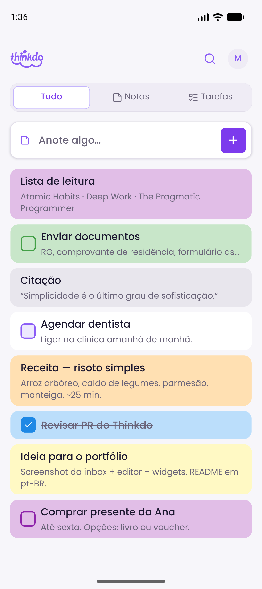
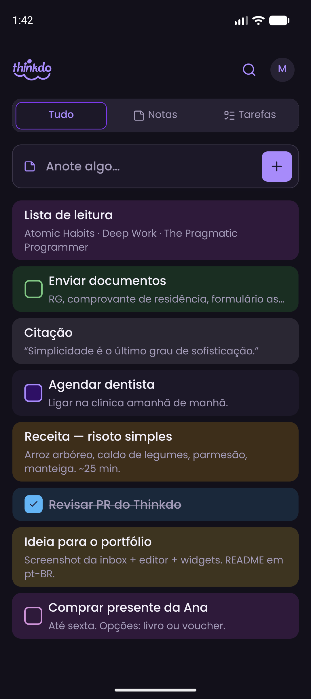
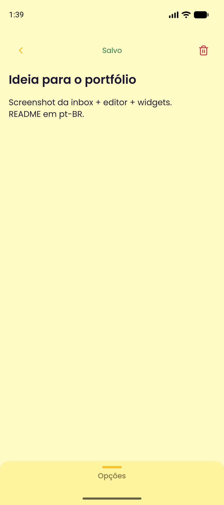
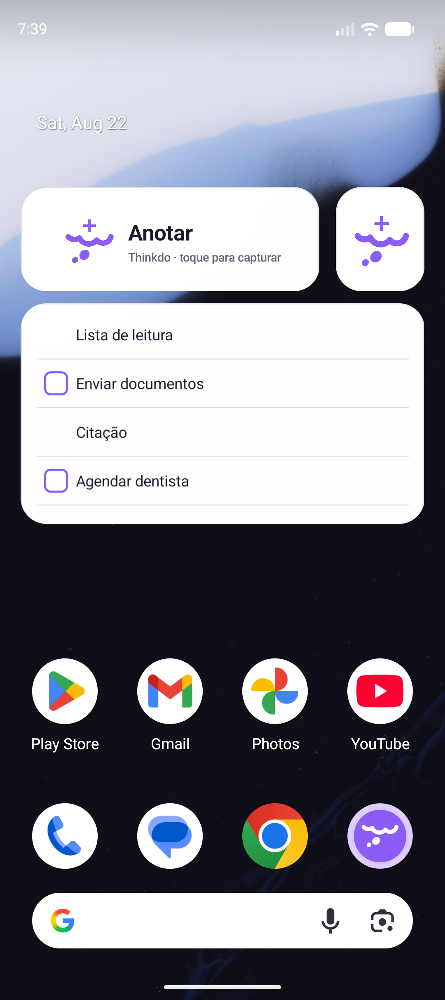

<div align="center">
  
</div>

<br />

<table>
  <tr>
    <td align="center" width="25%">
      
      <br /><sub>Inbox</sub>
    </td>
    <td align="center" width="25%">
      
      <br /><sub>Tema escuro</sub>
    </td>
    <td align="center" width="25%">
      
      <br /><sub>Editor</sub>
    </td>
    <td align="center" width="25%">
      
      <br /><sub>Widgets Android</sub>
    </td>
  </tr>
</table>

**Notas e tarefas na mesma inbox.** Um app mobile de captura rápida — abrir, escrever, salvar na nuvem em poucos toques.

Thinkdo nasce da frustração de alternar entre apps de anotação e de tarefas. A proposta é simples: **uma inbox unificada** com a leveza do Google Keep e a clareza do Todoist, sem virar um segundo gerenciador de projetos.

Projeto pessoal em uso diário. Interface em **pt-BR**.

---

## A ideia

| | |
|---|---|
| **Problema** | Ideias e pendências ficam espalhadas — ou você anota sem priorizar, ou gerencia tarefas num app pesado demais para captura rápida. |
| **Solução** | Um único lugar para capturar, editar e organizar. Nota vira tarefa (e vice-versa) com um toque. Filtros Tudo / Notas / Tarefas mantêm a inbox legível. |
| **Promessa** | Menos atrito entre “preciso lembrar disso” e “está salvo”. |

---

## O que o app faz

### Captura e inbox
- Barra de captura sempre visível — criar nota ou tarefa sem sair da lista
- Sync em tempo real com Firestore; novos itens entram no topo
- Busca local por título e corpo
- Filtros por tipo, reordenação por drag, swipe para excluir, seleção múltipla

### Editor
- Auto-save (~500 ms) com feedback discreto (Salvando / Salvo)
- Conversão nota ↔ tarefa, cor opcional por item, lembretes locais (único, diário ou semanal)

### Conta e preferências
- Login com Google ou email/senha (cadastro, reset de senha)
- Tema claro, escuro ou automático
- Banner offline — leitura ok, escrita pausada até voltar online

### Android widgets
Dois widgets na home screen, alinhados ao visual do app:
- **Thinkdo Anotar** — captura rápida direto da tela inicial (tile compacto ou card com label)
- **Thinkdo Inbox** — snapshot da lista, atualizado quando os dados mudam

<p align="center">
  
</p>

---

## Destaques técnicos

Decisões que valem mostrar no portfólio:

- **Expo SDK 57 + development build** — Google Sign-In nativo, widgets Android e notificações locais; fora do escopo do Expo Go de propósito
- **Camadas claras** — rotas finas em `app/`, UI em `components/`, domínio em `features/`, I/O em `services/`, widgets isolados em `src/widgets/`
- **Firestore em tempo real** — `onSnapshot` na inbox; rules com validação de shape (tipo, cor, lembrete, timestamps) e isolamento por usuário
- **Lembretes locais** — intenção persistida no Firestore, alarme agendado no aparelho via `expo-notifications`; reconciliação ao abrir o app
- **Widgets com snapshot** — lista espelhada em storage local para render offline no widget; refresh após mutações
- **Design system** — tokens de cor, tipografia (Poppins) e espaçamento; light/dark consistentes entre app e widgets
- **Testes unitários** — helpers de item, auth, lembretes, busca/seleção na inbox e lógica de widgets

---

## Stack

| Camada | Tecnologia |
|--------|------------|
| App | Expo 57 · Expo Router · React Native 0.86 · React 19 |
| UI | Reanimated · Gesture Handler · Lucide |
| Backend | Firebase Auth · Cloud Firestore |
| Nativo | Google Sign-In · expo-notifications · react-native-android-widget |
| Qualidade | TypeScript · Jest · ESLint |

---

## Estrutura (visão geral)

```
app/          → rotas e telas
src/
  components/ → UI reutilizável (inbox, editor, auth, settings)
  features/   → módulos de domínio (auth, reminders)
  services/   → Firebase (auth, items, reminders)
  widgets/    → render e snapshot dos widgets Android
  hooks/      → orquestração de estado
  lib/        → tema, helpers, init
firebase/     → rules e indexes
```

---

## Status

- **Uso:** app pessoal, Android-first
- **Escopo atual:** captura, inbox, editor, lembretes, widgets, tema — sem labels, prazos, offline-first ou rich text (roadmap consciente)
- **Licença:** [MIT](LICENSE)

---

<details>
<summary>Desenvolvimento local</summary>

Requer Node.js 18+, Android Studio, projeto Firebase (Auth + Firestore) e **development build** (`npx expo run:android` — não roda no Expo Go).

```powershell
copy .env.example .env   # preencher variáveis EXPO_PUBLIC_*
npm install
npx expo run:android
```

Rules do Firestore: `firebase/` → `npx firebase-tools deploy --only firestore`.

</details>
